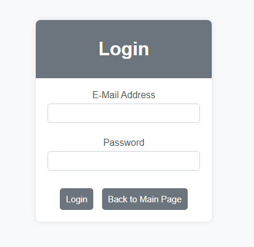
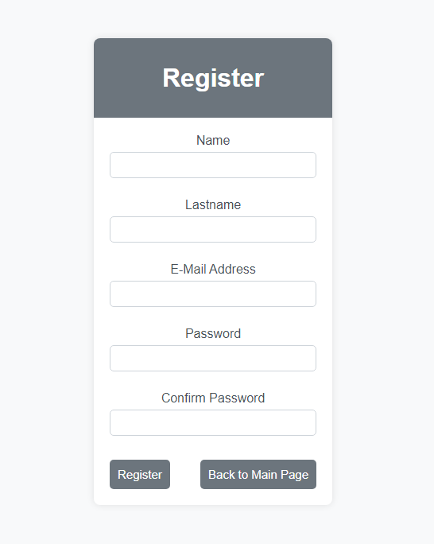
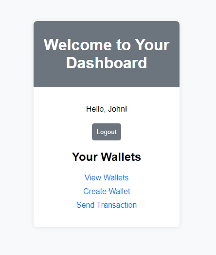
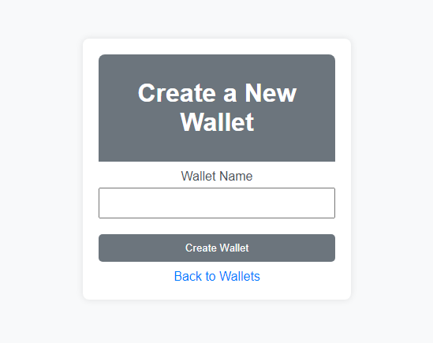
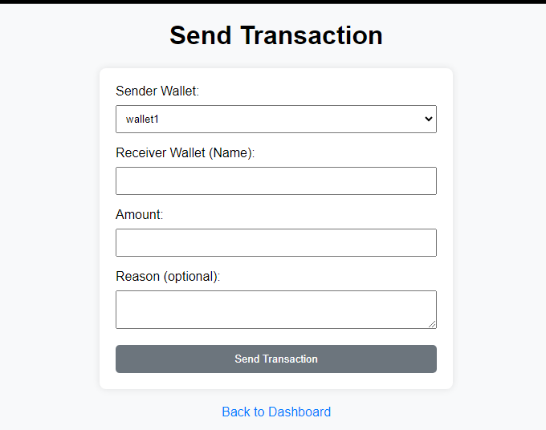
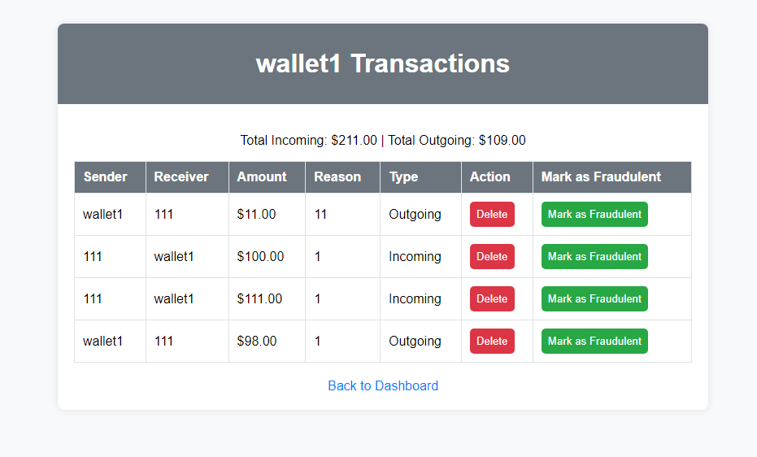

# Virtual Wallet

Virtual Wallet is a web application developed using PHP with the Laravel framework, backed by MySQL. This project provides users with a secure and user-friendly platform to create virtual wallets, send funds, and view transaction history.

## Features

### Login Page

### Register Page

### User Dashboard

### Create Wallet

### Transactions

### Transaction History

## Requirements
* [Git](https://git-scm.com/download/win)
* [MySql](https://www.mysql.com/downloads/)
* [PHP^7.4](https://www.php.net/downloads.php)

## Installation Guide
### Setting up

1. **Clone the Repository:**
   - Clone the Virtual Wallet repository to your local machine.

2. **Install Dependencies:**
   - Run `composer install` to install the required dependencies.

3. **Database Setup:**
   - Set up a MySQL database for the application.

4. **Environment Configuration:**
   - Copy the `.env.example` file and rename it to `.env`.
   - Configure the database connection settings in the `.env` file.

5. **Generate Application Key:**
   - Run `php artisan key:generate` to generate an application key.

6. **Run Migrations:**
   - Run `php artisan migrate` to create the necessary database tables.

7. **Serve the Application:**
   - Run `php artisan serve` to start the development server.

8. **Access the Application:**
   - Open your web browser and navigate to the URL provided by the `php artisan serve` command.

## Usage

Explore the following features of the Virtual Wallet application:

- **Login**: Access the login page to authenticate and access your account.
- **Register**: Sign up for a new account to start using the virtual wallet services.
- **Dashboard**: Navigate to the user dashboard to manage your virtual wallets and view transaction history.
- **Create Wallet**: Create new virtual wallets to organize your funds effectively.
- **Edit Wallet**: Modify existing wallet names to better suit your needs.
- **Delete Wallet**: Remove unwanted wallets from your account.
- **Transactions**: Send and receive funds between virtual wallets seamlessly.
- **Transaction History**: View detailed transaction history to track your financial activities.

